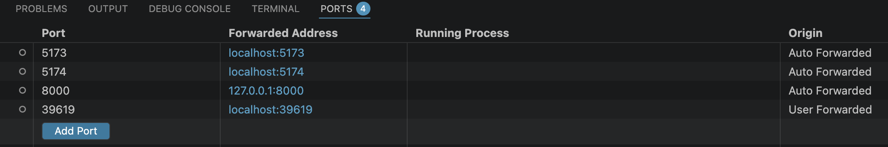
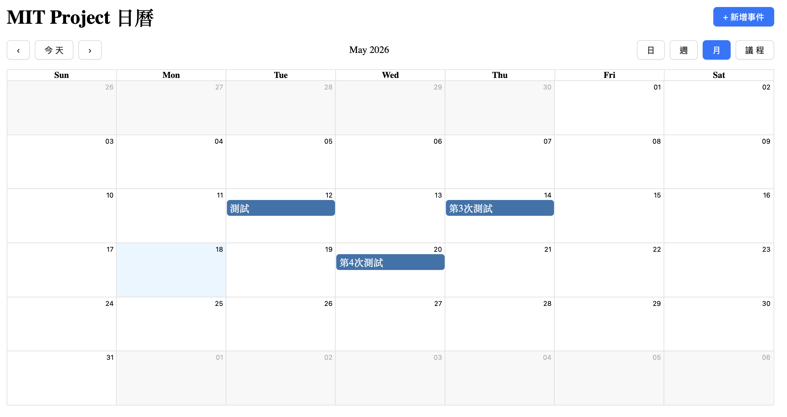
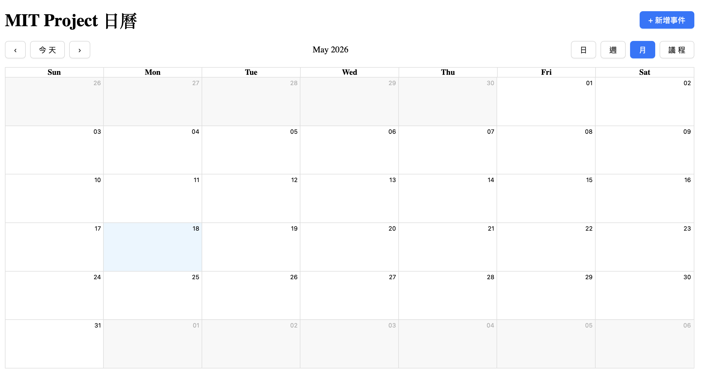
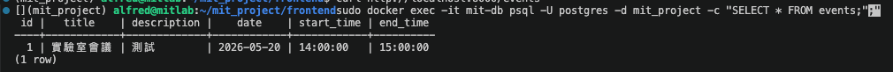
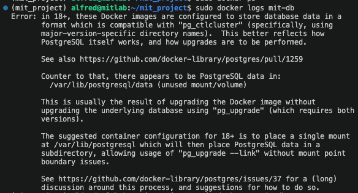
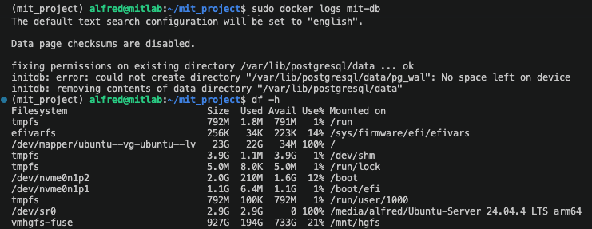
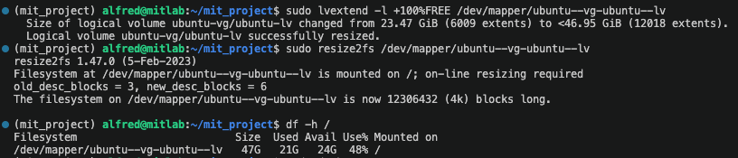

# 學習進度記錄

---

## 2026-05-18

### 遇到的問題與解決

**問題：同時出現 port :5173 和 :5174，:5174 是空的（CORS 問題）**



- 起因：Claude 之前用背景指令（`&`）啟動了 Vite，`pkill` 沒有完全停掉，:5173 仍被佔用
- 當自己再啟動一次 Vite，偵測到 :5173 被佔用，自動改用 :5174
- :5174 是空的，原本以為是後端沒開或資料庫限制，但其實都不是
- **真正原因：CORS**，後端 `main.py` 的白名單只有 `"http://localhost:5173"`，來自 :5174 的請求被擋掉，fetch 失敗，畫面空白

| :5173（CORS 通過，有資料） | :5174（CORS 被擋，空白） |
|---|---|
|  |  |

- 這正是之前學到的概念的實際體驗：origin 不在白名單就拿不到資料，瀏覽器 Console 會出現 CORS 錯誤
- 解決：`pkill -f vite` 殺掉舊實例，再重新 `npm run dev` 回到 :5173；或將後端 `allow_origins` 加入 `:5174`
- 補充：開發時可改成 `"*"` 允許所有來源，但上線時必須改回真實網址

### 完成項目
- 手動建立 Docker 自訂網路、Volume、PostgreSQL 容器、FastAPI 容器
- 修改 `main.py` 讓 `DATABASE_URL` 從環境變數讀取，開發與容器環境共用同一份程式碼
- 建立 `Dockerfile`，用 `uv` 安裝依賴並啟動 FastAPI
- 擴充 LVM，將根目錄從 23GB 擴充至 46GB
- 確認容器間網路連線正常，前端可透過容器化後端新增事件並持久化至 Volume



### 遇到的問題與解決

**問題 1：Docker 指令 permission denied**
- 原因：使用者不在 `docker` 群組，無法存取 `/var/run/docker.sock`
- 解決：`sudo usermod -aG docker $USER` 加入群組；短期用 `sudo` 繞過

**問題 2：PostgreSQL 容器啟動失敗（版本格式不相容）**
- 原因：`mit-db-data` Volume 是 3 週前 postgres:15 初始化的格式，現在的 `postgres:latest` 已升級到 v18，格式不相容，啟動時報格式錯誤
- 解決：改用 `postgres:15` 明確指定版本，與 Volume 格式一致；同時學到正式環境不應使用 `latest` tag



**問題 3：磁碟空間不足（根目錄 100% 滿）**
- 原因：Ubuntu 安裝時 LVM 只分配 23GB 給根目錄，剩下 ~24GB 在 Volume Group 中未分配；加上 Docker Image 佔用大量空間（postgres:latest 671MB、postgres:15 654MB、mit_test-web 296MB）
- 解決：
  1. `sudo docker system prune -a` 清除未使用的 Image 與快取，釋放 350MB
  2. `sudo lvextend -l +100%FREE /dev/mapper/ubuntu--vg-ubuntu--lv` 擴充 LV
  3. `sudo resize2fs /dev/mapper/ubuntu--vg-ubuntu--lv` 通知檔案系統變大
  4. 根目錄擴充至 46GB，可用空間 24GB

| 空間不足錯誤 | 擴充後恢復 |
|---|---|
|  |  |

**問題 4：`docker system prune -a` 把自訂網路和容器一起刪掉**
- 原因：`prune -a` 會刪除所有未使用的資源，`mit-db` 容器當時是 `Exited` 狀態，被判定為未使用，連帶把 `my-network` 也刪了
- 解決：重新建立網路和容器；Volume `mit-db-data` 不受影響，資料保留
- 學到：`docker system prune -a` 是高風險指令，執行前要確認哪些資源會被刪除

**問題 5：容器狀態 `Created` 但沒有啟動（網路找不到）**
- 原因：`my-network` 被 prune 刪除後容器嘗試啟動找不到網路，一直停在 `Created`
- 解決：重建網路後 `docker start mit-db` 成功啟動

### 學到的概念

**Docker 三大核心元素**
- **Image**：唯讀模板，由 Dockerfile build 產生或從 Docker Hub 下載
- **Container**：Image 的執行實例，可隨時刪除重建；建立參數（網路、port、環境變數）一旦設定不能修改，要改就刪掉重建
- **Volume**：獨立於容器生命週期的持久化儲存；容器刪掉資料不消失

**Docker 網路**
- 預設 `bridge` 網路：容器只能用 IP 互訪，不能用名稱（沒有 DNS）
- 自訂網路：Docker 內建 DNS server（`127.0.0.11`），容器名稱自動解析成 IP，可以用名稱互訪
- DNS 是 1983 年就有的技術，Docker 只是在自訂網路才啟用它，預設 bridge 為了向下相容保持舊行為
- 指令：`docker network create <name>`、`docker network ls`、`docker network rm <name>`

**容器化後的架構**
```
前端 React（本地 :5173，開發時不包進 Docker）
      ↓
mit-api 容器（FastAPI :8000，對外暴露）
      ↓
mit-db 容器（PostgreSQL :5432，只在 my-network 內部）
      ↓
mit-db-data Volume（資料持久化）
```

**環境變數控制連線設定**
- `main.py` 改用 `os.getenv("DATABASE_URL", "postgresql://...@localhost...")` 
- 本地開發不傳環境變數，走 fallback 連 localhost
- 容器啟動時用 `-e DATABASE_URL=...@mit-db:...` 覆蓋，連容器名稱

**為什麼不用 latest tag**
- `postgres:latest` 3 週前下載是 v15，現在更新成 v18，Volume 格式不相容導致容器無法啟動
- 正式環境要明確指定版本號（如 `postgres:15`），確保每次跑的都是同一版

**LVM（邏輯卷管理）**
- Ubuntu 安裝時預設只分配一半空間給根目錄，剩下在 VG 中未分配
- `vgdisplay` 查看 VG 可用空間，`lvextend` 擴充，`resize2fs` 通知檔案系統

### 下次待辦
- [ ] 撰寫 docker-compose.yml，讓別人一鍵啟動整個專案
- [ ] 部署至雲端平台（Render / Railway）

### 學到的概念

**Claude Code 的 shell 限制**
- Claude 只有一個 shell 環境，同一時間只能執行一件事
- 背景執行（指令加 `&`）：程式在後台跑，不佔 shell，但看不到 log，也沒辦法 Ctrl+C
- 前景執行（不加 `&`）：Claude 的工具會卡住，沒辦法繼續回應
- Subagent 也有同樣限制，而且跑完任務就結束，無法維持 server 持續運行
- 結論：啟動 FastAPI 和 React dev server 這類持續運行的程式，應該自己在 VS Code 終端機開分頁執行，才能看到 log 且可以 Ctrl+C 控制

---

## 2026-05-17

### 完成項目
- 完成前端 CRUD：新增編輯事件 modal、點月曆格子自動帶入日期、串接後端 PUT API
- 套用 Ant Design（antd）UI 元件庫，改用 Modal、Form、Button、DatePicker、TimePicker
- 修正 CSS 衝突問題（詳見下方）
- 新增自訂 toolbar，檢視按鈕改為日→週→月→議程順序
- 將套件管理從 `requirements.txt` 遷移至 `uv init`（pyproject.toml + uv.lock）

### 學到的概念

**Port 與三層架構**
- 前端 :5173、後端 :8000 需要對外暴露，出現在 VS Code port 列表
- PostgreSQL :5432 只在 VM 內部被 FastAPI 連線，不需要對外，不會出現在列表
- VS Code 會自己開隨機 port（如 :39619）供內部擴充功能使用，與專案無關

**npm 套件管理**
- `package.json` = 套件清單（對應 Python 的 `pyproject.toml`）
- `package-lock.json` = 鎖定版本（對應 `uv.lock`）
- `npm install <套件>` = 安裝並自動更新 `package.json`
- `node_modules/` = 虛擬環境（對應 `.venv/`）
- `npm install` 執行時不會影響正在跑的 dev server，Vite 會自動偵測新套件

**uv 套件管理遷移**
- `uv init` 建立 `pyproject.toml` 與 `.python-version`
- `uv add <套件>` 自動更新 `pyproject.toml` 並產生 `uv.lock`
- 比 `requirements.txt` 方便：不用手動維護，有鎖定檔確保版本一致
- 遷移步驟：`uv init` → `uv add fastapi uvicorn sqlalchemy psycopg2-binary`

**react-big-calendar vs antd Calendar**
- antd 的 `Calendar` 只是選日期用的元件，無法顯示多個事件、無法切換週/日/議程
- react-big-calendar 專為行事曆 app 設計，支援事件顯示、多種檢視、點擊互動
- 兩者並用：antd 負責按鈕/modal/表單，react-big-calendar 負責月曆本體

**React 受控元件（Controlled Component）**
- react-big-calendar 預設自己管理 view 狀態（uncontrolled）
- 換成自訂 toolbar 後，需要自己用 `useState` 管理 `currentView`
- 傳入 `view={currentView}` 和 `onView={setCurrentView}` 才能讓按鈕切換生效
- 原則：自訂子元件替換預設後，原本內部的狀態需要由外部接管

### 遇到的問題與解決

**問題 1：非當月日期變白色、導覽按鈕消失**
- 原因 A：Vite 建立專案時自動產生的 `index.css` 含有 `color-scheme: light dark`，系統深色模式下會把頁面背景變黑，蓋掉月曆顏色
- 原因 B：`index.css` 的 `#root { text-align: center }` 影響月曆排版
- 解決：清除 `index.css` 的模板內容，只保留 `body { margin: 0 }`
- 補充：安裝 antd 後也會有 CSS 衝突，在 `App.css` 加 override 修正 `.rbc-off-range` 和 toolbar 按鈕樣式

**問題 2：自訂 toolbar 按鈕點下去沒反應**
- 原因：月曆的 view 狀態沒有被外部控制，換成自訂 toolbar 後按鈕觸發的 `onView` 無法更新畫面
- 解決：加入 `const [currentView, setCurrentView] = useState('month')`，並傳給 Calendar

**問題 3：`git push` 從我的 shell 執行失敗**
- 原因：我的 shell 是非互動模式，沒有 TTY，git 無法提示輸入帳號密碼
- VS Code 的終端機有存取 credential cache 的權限，所以從終端機 push 正常
- 結論：git push 需要由使用者自己在終端機執行

### 下次待辦
- [x] Docker 容器化（FastAPI + PostgreSQL）
- [x] Docker 自訂網路連接容器
- [ ] 撰寫 docker-compose.yml
- [ ] 部署至雲端平台（Render / Railway）

---

## 2026-05-16

### 學到的概念

**專案整體架構複習**
- 三層架構：前端（React :5173）→ 後端（FastAPI :8000）→ 資料庫（PostgreSQL :5432）
- Pydantic BaseModel：自動驗證前端傳來的 JSON，欄位不符直接回 400 錯誤
- SQLAlchemy engine：Python 連線 PostgreSQL 的「連線池」，送 SQL 指令用
- REST 設計風格：用 HTTP 方法（GET/POST/PUT/DELETE）對應 CRUD 操作
- React useState：state 變了畫面自動更新，不用手動操作 DOM
- useEffect + fetch：元件載入時自動從後端拉資料（空依賴 `[]` = 只執行一次）

**CORS 深入理解**
- CORS = Cross-Origin Resource Sharing，跨來源資源共享
- 「來源」定義：協定 + 網域 + port，三者都相同才算同源
- 同源政策是**瀏覽器**內建的安全機制，curl 等非瀏覽器工具不受限制
- 流程：瀏覽器先送 Preflight（OPTIONS）帶 `Origin` header → 後端回應允許的來源 → 瀏覽器比對決定是否放行
- 沒設 CORS 的結果：請求可能有送到後端，但瀏覽器把回應藏起來，JS 拿不到資料
- 簡單請求（GET/POST + 無自訂 header）不需要 Preflight，但回應仍可能被擋
- 上線時 `allow_origins` 要改成真實網址，不能用 `"*"`

**CORS 保護的安全場景（CSRF 攻擊）**
- 攻擊前提：使用者登入銀行後，cookie 留在瀏覽器；此時被騙開了 evil.com
- evil.com 的 JS 在使用者瀏覽器上執行，可以呼叫 fetch() 發送請求
- 瀏覽器送跨來源請求時會自動夾帶目標網站的 cookie（evil.com 讀不到但瀏覽器會帶）
- 同源政策阻止 evil.com 冒充使用者打 bank.com 的 API
- 駭客用 curl 直接打不行，因為沒有使用者的 cookie，後端回 401

**curl**
- 命令列 HTTP 工具，可直接送請求並印出回應，常用來測試 API
- 不是瀏覽器，不受同源政策限制

---

## 2026-05-11

### 完成項目
- Git 初始化，連接 GitHub remote（`main` 分支）
- 安裝 uv，建立 Python 虛擬環境
- 安裝 FastAPI + uvicorn，建立基本 API（`/`、`/db-test`）
- 安裝 PostgreSQL，建立 `mit_project` 資料庫
- 安裝 SQLAlchemy + psycopg2，FastAPI 成功連線 PostgreSQL
- 安裝 Node.js v22，用 Vite 建立 React 前端專案
- 前端透過 fetch 呼叫後端 API，成功串接前後端
- 建立 `events` 資料表，實作日曆應用 CRUD API
- 安裝 react-big-calendar + dayjs，完成月曆 UI
- 測試新增事件、刪除事件功能正常

### 學到的概念
- Docker 網路：`docker network create` 建立自訂子網，容器間用名稱互訪
- HTTP 方法：GET / POST / PUT / DELETE 對應 CRUD
- uv vs npm：Python 套件與 JS 套件是獨立環境
- Vite HMR：程式碼變更後瀏覽器自動更新
- CORS：前後端跨 port 呼叫需要在後端設定允許來源

### 下次待辦
- [ ] 前端加入修改事件（Update）介面
- [ ] Docker 容器化（FastAPI + PostgreSQL）
- [ ] Docker 自訂網路連接容器
- [ ] 繼續開發日曆功能

---
